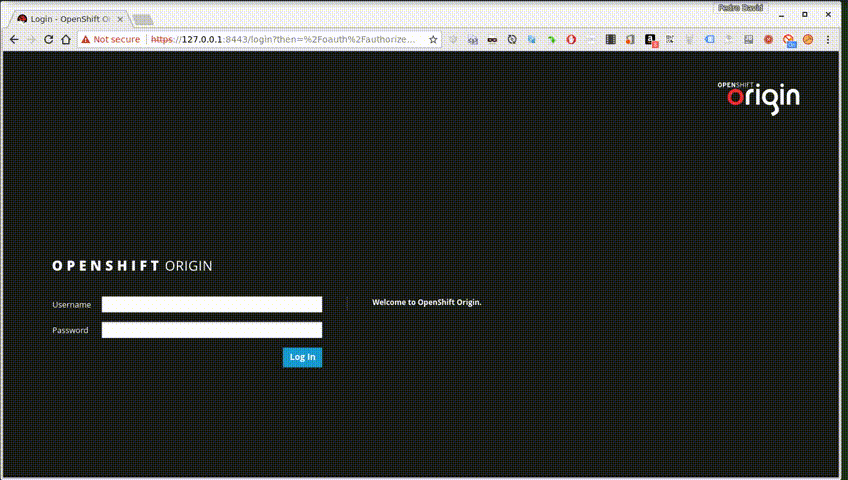

# Vadoma

**Vadoma, a simple node app to import lists from Sharepoint (versions around 2013) to Elasticsearch (versions around 6.0.x)**

## Use

To clone and run this repository you'll need [Git](https://git-scm.com) and [Node.js v8](https://nodejs.org/en/download/) (which comes with [npm](http://npmjs.com)) installed on your computer. From your command line:

```bash
# Clone this repository
$ git clone https://github.com/neowinx/vadoma.git
# Go into the repository
$ cd vadoma
# Install dependencies
$ npm install
# Edit settings in **config.json**
$ nano config.json
# Run the app
$ npm start
```

And it will start the import right away (**I mean it**, it will start as soon as you press enter... ok?... ok)

## `Stash` mode

`Vadoma` can also check periodically for new items in the list. To do so, just especify in the corresponding configuration a datetime field used to check for new items comparing the current date and then start `vadoma` in `stash` mode:

```bash
$ npm start stash
```

## `Recreate` index

If you pass the `recreate` argument to `Vadoma`, like this:

```bash
$ npm start recreate
```

Vadoma will recreate the index and use the mappingData json to apply that config in the recreated index (if there is the mappingData option in the configuraion that is)

## Docker

There is an image created for vadoma with docker. You can use it like this:

```bash
$ docker run -ti -e SHAREPOINT_LIST=MyList -e SHAREPOINT_URL=http://my.sharepoint.net -e SHAREPOINT_USER=user@my.sharepoint.net -e SHAREPOINT_PASSWORD=My@pass -e ELASTIC_URL=http://localhost:9200 -e ELASTIC_USERNAME=elastic -e ELASTIC_PASSWORD=changeme neowinx/vadoma
```

for `stash` mode:

```bash
$ docker run -ti -e SHAREPOINT_LIST=MyList -e SHAREPOINT_URL=http://my.sharepoint.net -e SHAREPOINT_USER=user@my.sharepoint.net -e SHAREPOINT_PASSWORD=My@pass -e ELASTIC_URL=http://localhost:9200 -e ELASTIC_USERNAME=elastic -e ELASTIC_PASSWORD=changeme neowinx/vadoma npm start stash
```

### Docker Build

To build a your own image, you can use the `Dockerfile` included in this repo using the docker build command:

```bash
$ docker build -t my-vadoma .
```

An then you can use the generated image like this:

```bash
$ docker run -ti my-vadoma
```

and for `stash` mode:

```bash
$ docker run -ti my-vadoma npm start stash
```

## Openshift

Vadoma incudes a Openshift template. To create the template inside your Openshift, you can do something like this:

```bash
$ oc login -u system:admin
$ oc create -f vadoma.yml
```



## Configuration

The _config.json_ is (as you may have guessed) a straightforward json file with this content:

```json
{
  "sharepoint" : {
    "url" : "http://sharepoint.example.org:8080",
    "username" : "sharepoint@example.org",
    "password" : "Password@Example.org",
    "list" : "MyList"
  },
  "elastic" : {
    "url" : "http://localhost:9200",
    "index": "marcolegal2",
    "username" : "elastic",
    "password" : "changeme"
  },
  "stash" : {
    "fields" : "Created,Modified",
    "timeout" : 15000
  },
  "coalesce": [
    {
      "list": "Cats",
      "joinOrigin": "ID",
      "joinTarget": "cat_id",
      "field": "Name"
    },{
      "list": "Dogs",
      "joinOrigin": "ID",
      "joinTarget": "Dog_ID",
      "field": "Name"
    }
  ],
  "mappingData" : {
    "properties": {
      "Description": {
        "type": "text",
        "fields": {
          "keyword": {
            "type": "keyword",
            "ignore_above": 256
          },
          "folded": {
            "type": "text",
            "analyzer": "folding"
          }
        }
      }
    }
  }
}
```

- **sharepoint.url** : The url of the endpoint of your sharepoint api
- **sharepoint.username** : The username for basic authentication on your sharepoint
- **sharepoint.password** : The password for basic authentication on your sharepoint
- **sharepoint.list** : The name of the sharepoint list you want to import
- **elastic.url** : The url of your elasticsearch endpoint to use for the import
- **elastic.index** : The name of the index in the elastisearch to use
- **elastic.username** : The username of your elasticsearch for authentication
- **elastic.password** : The password of your elasticsearch for authentication
- **stash.fields** : Used for the `stash` mode. The Datetime fields separated by commas used to check for new items in the list
- **stash.timeout** : Used for the `stash` mode. The time used for the interval to check for new items in the list
- **coalesce** : This list contains information that vadoma can use in order to add fields from another lists to the resulset
- **mappingData** : Used when the **recreate** option is passed as argument. Apply this mappingData to the index after the recreation. Here you can add personalized attributes if needed

### Environment variables

Every configuration has its corresponding environment variable override. It follows the format where every word has been upercased and the dots replaced by underscores i.e.: my.config <==> MY_CONFIG.

So the list of variables that replaces its corresponding configuration is:

| Environment Variable 	| Configuration        	|
|---------------------	|---------------------	|
| SHAREPOINT_URL      	| sharepoint.url      	|
| SHAREPOINT_USERNAME 	| sharepoint.username 	|
| SHAREPOINT_PASSWORD 	| sharepoint.password 	|
| SHAREPOINT_LIST     	| sharepoint.list     	|
| ELASTIC_URL         	| elastic.url         	|
| ELASTIC_INDEX        	| elastic.index        	|
| ELASTIC_USERNAME    	| elastic.username    	|
| ELASTIC_PASSWORD    	| elastic.password    	|
| STASH_FIELDS         	| stash.fields        	|
| STASH_TIMEOUT       	| stash.timeout       	|
| COALESCE              | coalesce              |
| MAPPING_DATA       	| stash.mappingData    	|

### Coalesce configuration

The coalesce option is used by **Vadoma** in order to import related data to the index, from other indexes.

For example, lets say you have a field `TableID` that references the `ID` field of a `Tables` lists inside another 
Sharepoint instance (lets say `http://myothersharepoint:8080` for example) and you want to import the `Description` 
field of `Tables` from the referencing `TableID` in the resulset of the index 

So, a valid configuration to achieve that is setting the coalesce value like this:

```json
  "coalesce": [
    {
      "url": "http://myothersharepoint:8080",
      "username": "myotherusername",
      "password": "myotherpassword",
      "list": "Table",
      "joinOrigin": "ID",
      "joinTarget": "TableID",
      "field": "Description"
    }
  ]
```

Every `Description` value will be added to the resulset in the format `Table`.`Description` in the resulset before sending
it to elasticsearch

Note: These fields

      "url": "http://myothersharepoint:8080",
      "username": "myotherusername",
      "password": "myotherpassword",

are optional and can be ommited. The values of each one will be taken from the corresponding vaule in the `sharepoint`
config key inside `config.json`

## FAQ

### Why you have created this?

I couldn't find a suitable logstash plugin to do the import of and entire list from _Sharepoint_ to _Elasticsearch_ and it was easier for me to create something like this

### WTF Vadoma means?

Supposedly *Vadoma* was in the common gypsy names list, so I found adequate to name something that serves to migrate stuff with a gypsy name

### I dont like this it is ugly, inefficient and it is not programmed in my super awesome language because blablabla...

Just don't use it... and let others live

## License

[CC0 1.0 (Public Domain)](LICENSE.md)
